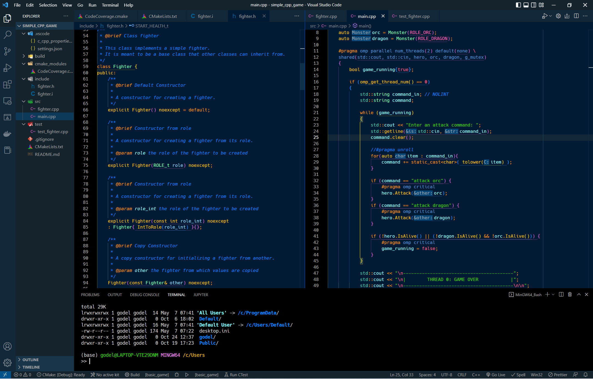
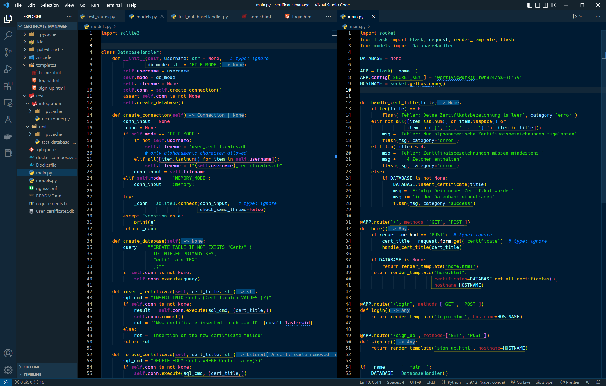
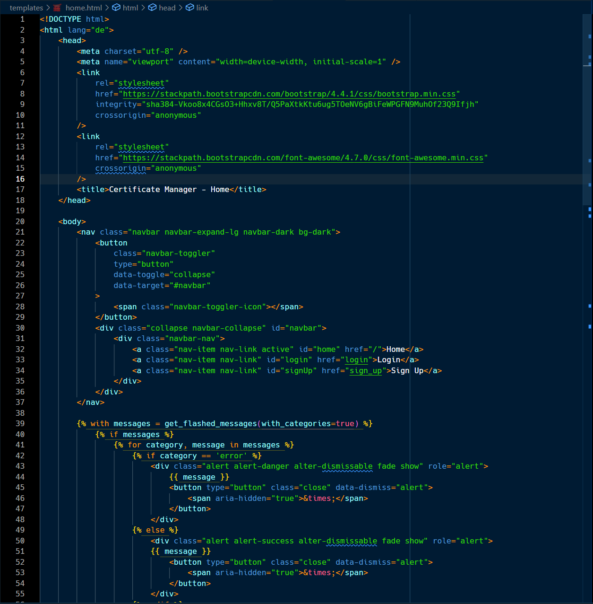

# Cobalt Theme Next Generation

This VSCode color theme is inspired by the cobalt theme from
 [Gnome Editor](https://de.wikipedia.org/wiki/Gedit) aka **Gedit**.

## Examples

C++

Python

HTML

## Usage

1. Clone this repository in folder  `~/.vscode/extensions/`
2. Reload VSCode editor Windows. This theme will be available as color theme with name `Cobalt Theme NG`
3. Add the following to your settings.json: `"workbench.colorTheme": "Cobalt Theme NG"`

Enjoy it! :wink: :wink:
